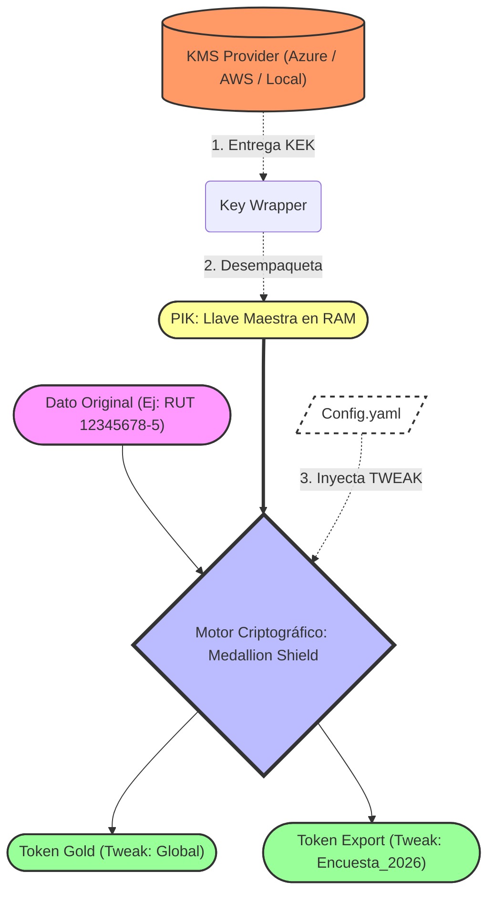

# Guía de Entendimiento: Motor Criptográfico por Capas

El **Anonymizer Engine (Medallion Shield)** implementa una arquitectura de "Privacidad por Capas" diseñada específicamente para entornos de Big Data (PySpark). Su objetivo es ofuscar datos personales (PII) asegurando que sigan siendo útiles para análisis (JOINs referenciales) pero imposibles de re-identificar sin autorización.

## Conceptos Core

### 1. La Ecuación Criptográfica y el Flujo de Datos

Para visualizar cómo el motor transforma un dato en bruto (Capa Bronze/Silver) hasta llegar a un estado seguro (Capa Gold) sin perder utilidad analítica, observa el siguiente diagrama:

La fórmula matemática que gobierna el motor en el nodo central es:
`Token = FPE(Dato, PIK_unwrapped, Tweak)`

- **PIK (Protected Input Key):** Es la llave maestra criptográfica constante para toda la empresa. Garantiza que, si aplicamos FPE sobre el RUT `12345678-5` en la misma capa, siempre arrojará el mismo resultado.
- **Tweak (Sal):** Es una variable de dominio que tú controlas. Permite que la misma PIK arroje resultados distintos dependiendo del destino del dato.

*(Ejemplo Válido: Usamos el Tweak "Capa_Gold" para que Análisis de Datos pueda hacer JOINs entre la tabla Ventas y la tabla Clientes. Si extraemos para una Encuesta Externa, cambiamos el Tweak a "Encuesta_2026", de modo que si se roban la encuesta, jamás podrán hacer JOIN con la base de datos central).*

### 2. Wrapping de Llaves (Inversión de Dependencias KMS)
No guardamos la PIK en texto plano. La guardamos encriptada ("Wrapped").
Para desencriptar la PIK en memoria durante la ejecución, el motor se conecta a un proveedor externo (Azure Key Vault, AWS KMS, o una llave Local en desarrollo) que provee la **KEK (Key Encryption Key)**.

El contrato que define cómo hablar con el gestor de llaves vive en `core/crypto/kms_base.py`. Si tu empresa migra de Azure a AWS, solo escribes un nuevo Provider; el resto del código PySpark **no cambia**.

### 3. PySpark y UDFs (Distribución)
Todo el mapeo de PII y la inyección de la llave (Desempaquetar la PIK) ocurre una sola vez en el Driver de Spark. Luego, utilizando UDFs (User Defined Functions), enviamos la orden criptográfica pre-configurada a cada Worker Node para ejecutarse paralelamente contra gigabytes de datos en la memoria del clúster.
