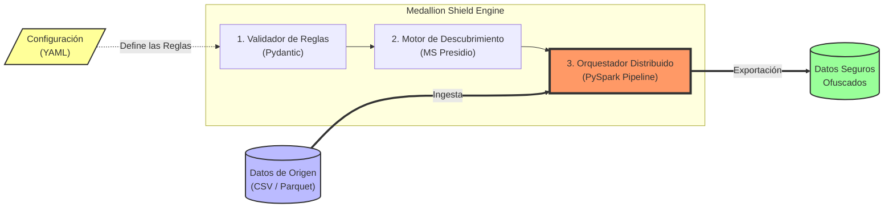

# Guía de Uso Rápido: Probando Medallion Shield

¡El motor ya está listo para ser probado localmente! Puedes probarlo de dos maneras: enviándole datos en crudo simulados en el script (Mock Data), o pasándole archivos reales **CSV** o **Parquet**.

## Requisitos Previos

Antes de ejecutar el pipeline, debes asegurarte de estar dentro del entorno virtual y de que la llave maestra del sistema (KEK) esté configurada en tus variables de entorno.

```bash
# 1. Activar el entorno virtual
source venv/bin/activate

# 2. Setear la Master Key de prueba (o usar la que viene por defecto)
export MEDALLION_MASTER_KEY="rY7b4Ww3F2yA-t9gN6_xLk8ZpQq5_vB1cJmXDeGzNRo="
```

## Estructura de Arquitectura de Alto Nivel

El repositorio aísla limpiamente el motor lógico (Core) del orquestador de datos (PySpark). Para un detalle profundo nivel archivo, por favor lee: **[Guía de Estructura de Proyecto y Archivos](project_structure.md)**.



---

## 💻 Forma 1: Probar con datos simulados (Default)

Si ejecutas el motor sin pasarle ningún archivo, automáticamente creará 3 registros de prueba en la memoria de Spark (Luis, María y Juan) y les aplicará las reglas del `sample_config.yaml`.

**Comando:**
```bash
python engine/pipeline.py --config config/sample_config.yaml
```

**Qué verás:** 
Spark te mostrará la tabla original y luego la tabla anonimizada mostrando el `rut_cliente` con FPE y el `email` con Hash SHA-256.

---

## 📁 Forma 2: Probar con tus propios archivos (CSV / Parquet)

El pipeline ahora soporta la ingesta de archivos reales. Para probarlo, solo debes usar el argumento `--input`.

### Para probar con un CSV:
Si tienes un archivo llamado `mis_clientes.csv` (asegúrate de que tenga cabeceras):

```bash
python engine/pipeline.py \
    --config config/sample_config.yaml \
    --input mis_clientes.csv \
    --format csv
```

### Para probar con un Parquet:
Si tienes una tabla comprimida `datos_gold.parquet`:

```bash
python engine/pipeline.py \
    --config config/sample_config.yaml \
    --input datos_gold.parquet \
    --format parquet
```

*(Opcional: Si quieres guardar el resultado anonimizado en vez de solo imprimirlo por pantalla, puedes pasar el flag `--output ruta/destino/`)*

---

## ⚙️ ¿Cómo configuro las reglas para mis archivos?

Si tu archivo CSV tiene una columna llamada `identificador_nacional` y otra llamada `correo_electronico`, debes **ajustar el archivo de configuración YAML** para que el motor sepa actuar sobre ellas.

Abre el archivo `config/sample_config.yaml` y asegúrate de que el bloque `rules` apunte exactamente a los nombres de las columnas de tu CSV:

```yaml
rules:
  - column: "identificador_nacional"   # <--- Nombre de TU columna
    recognizer: "chilean_rut"
    anonymization: "rut_fpe"
  - column: "correo_electronico"       # <--- Nombre de TU columna
    recognizer: "email"
    anonymization: "email_hash"
```
